# Project : Educational data analysis

## Project overview

* This project compares countries performance accross several educational-related indicators and produces a ranking with a scoring tool

* It may be useful for the method it deploys and to understand how data visualization may be helpful for any BI project 
&nbsp;

## Workflow summary 	

- explored educational-related data from World Bank database

- identified relevant indicators

- produced visualizations to compare regions/countries accross these indicators over time

- defined a score to rank countries accross selected indicators and make business decisions 
&nbsp;

  

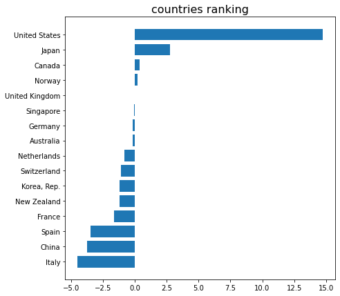

## Project installation

* use command pip install -r requirements.txt. to install the dependencies

* the data is stored as a zip file and should threfore be unzipped before reproducing code in the notebook
&nbsp;

## Detailed workflow
&nbsp;

### Exploring data
&nbsp;

#### Shape

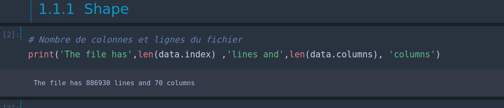
&nbsp;

#### Duplicates

* A line in the table = an unique indicator/country pair and its values accross years
* There are no duplicates

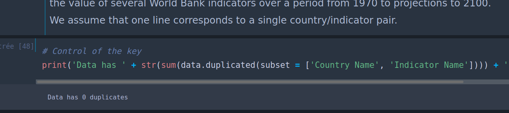
&nbsp;

#### Indicators topics

* Indicators can be grouped into more general topics
* Most represented topics in the data are :
    * Learning outcomes
    * Attainment

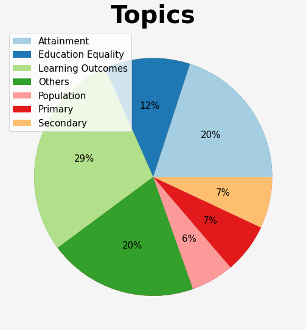
&nbsp;

### Filters

* Years selection : keeping 1990-2030 data
* Indicators : 

    * Wealth indicators : 
        * Absolute:
            * GDP at market prices (constant 2005 US dollar)
            * GDP, PPP (constant 2011 international dollar)
        
        * Relative : 
            * GDP per capita (constant 2005 US dollar)
            * GDP per capita, PPP (constant 2011 international dollar)
        
        
        
    * Demographic indicators of access to education : 
        * Relative : 
            * Adjusted net enrolment rate, upper secondary, both sexes (%)
            * Total net enrolment rate, upper secondary, both sexes (%)
            * Gross enrolment ratio, upper secondary, both sexes (%)
            * Gross enrolment ratio, post-secondary non-tertiary, both sexes (%)
            * Gross enrolment ratio, tertiary, both sexes (%)  
        * Absolute : 
            * School age population, upper secondary education, both sexes (number)
            * School age population, tertiary education, both sexes (number)
            * Enrolment in post-secondary non-tertiary education, both sexes (number)
             * Enrolment in tertiary education, all programmes, both sexes (number)
            * Population growth (annual %)
          

    * Literacy Indicators :
        * Youth literacy rate, population 15-24 years, both sexes (%)
        * Adult literacy rate, population 15+ years, both sexes (%)

    * Connectivity Indicators :
        * Internet users (per 100 people)
        * Personal computers (per 100 people)
&nbsp;

&nbsp;

* Some years are very deficient in data, eg. 2017-2030
* Some indicators are deficient accross years in terms of fulfillment
* s

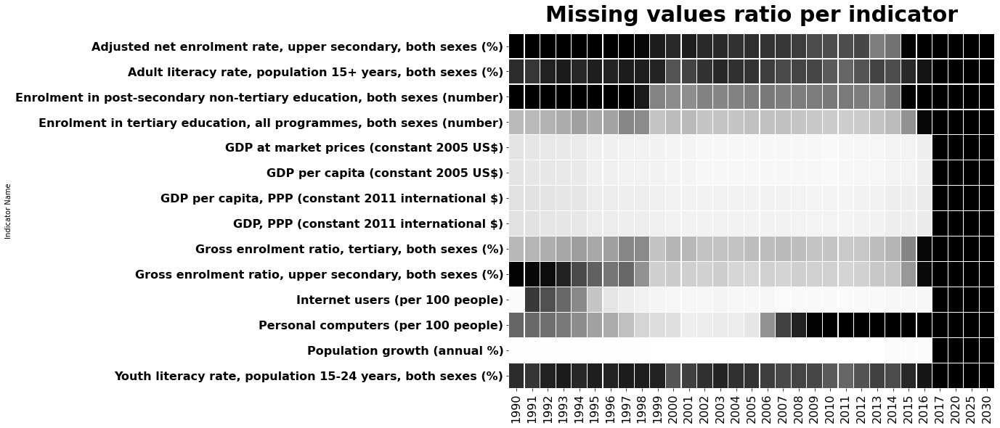
&nbsp;

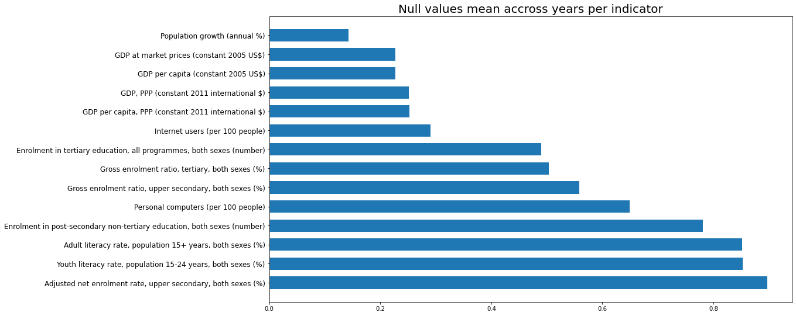
&nbsp;

* Will be kept to pursue the analysis :
    * GDP and population growth, which are well fulfilled
    * Internet access is also well informed
    * Finally, even if they have about 50% missing values, the indicators of enrolment rates in upper secondary and university (tertiary) education can be retained in the rest of the analysis.

* Among all the indicators measuring GDP, we will select : 
    * 'GDP at market prices'
    * 'GDP per capita' calculated on the oldest basis, in constant 2005 dollars. 

* Will be discarded: 
    * The indicator that measures the rate of access to a personal computer has an uneven fill. It was correctly filled before 2010 and much less so since then. It will be excluded from the analysis.
    * All other indicators are far too sparse over the periods concerned and will be discarded in the rest of this analysis.
&nbsp;

#### Distribution

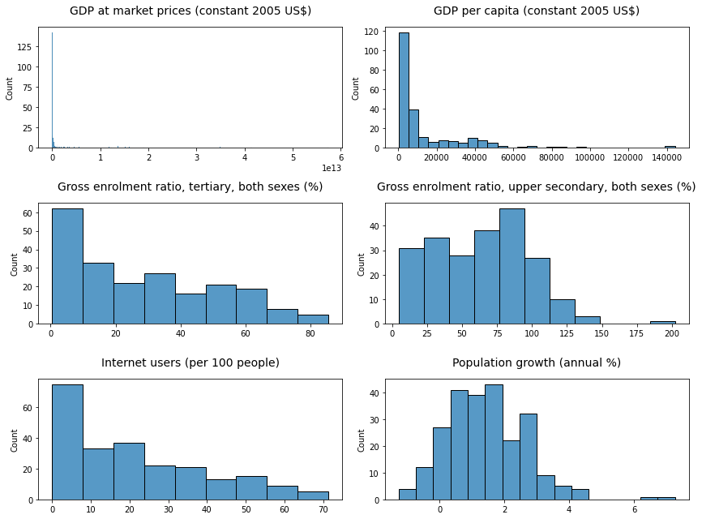
&nbsp;

* The distribution of the GDP indicator shows a great dispersion, being strongly skewed to the right. Some countries have a much higher GDP than most other countries

* The same trend can be observed in the GDP/capita indicator and in the Internet access rate indicator, which was to be expected
&nbsp;

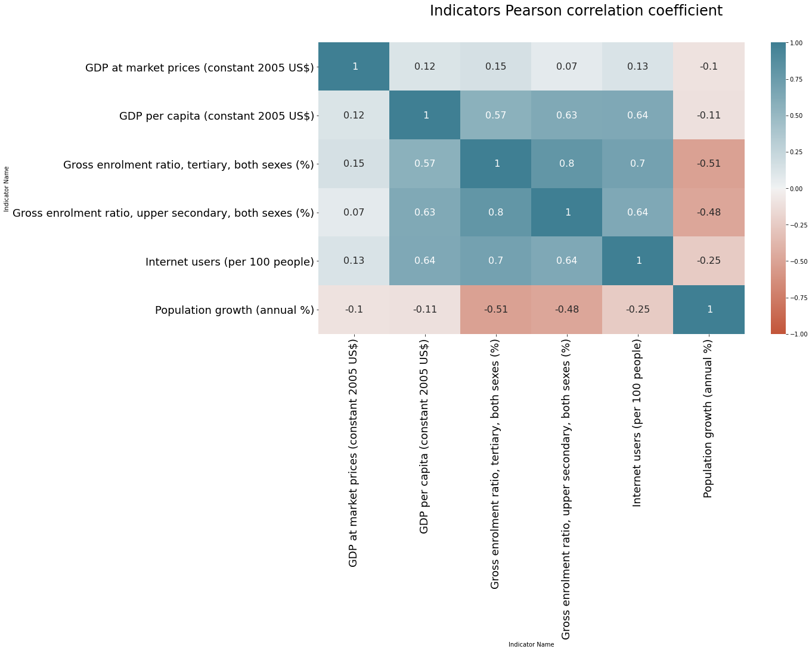
&nbsp;

* The Pearson correlation is very sensitive to outliers in distributions and assumes Gaussian distributions, condition that is not met here

* Therefore the insights given by the correlation matrix should not be interpreted as robust dependencies 

* The correlation matrix shows us that 4 indicators seem to be positively correlated with each other 
    * Upper secondary and university enrolment rates have a correlation coefficient of 0.8, which is very high
    * The 4 indicators that have a positive correlation coefficient are :
        * the Internet access rate, 
        * the high school enrolment rates
        * university enrolment rates
        * and the GDP per capita
        
    * With coefficients close to 0, the GDP indicator is not correlated with the other indicators
    * Finally, the demographic indicator of population growth seems to be negatively correlated (coefficient close to -0.5) with the schooling indicators. Countries with higher school enrollment tend to have a lower population growth

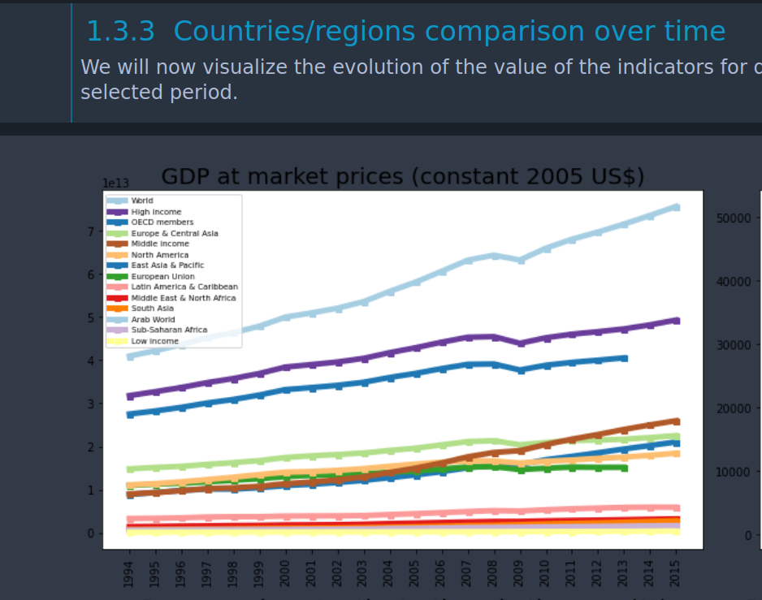
&nbsp;

### Key indicators : GDP, internet, pop growth

* For the rest of this analysis, we will focus on the following three indicators: 

    * GDP
    * Internet access rate
    * population growth

* Indeed, the analysis of the correlation of the indicators has shown us that these three indicators are not correlated with each other and that they therefore each provide a share of non-redundant information

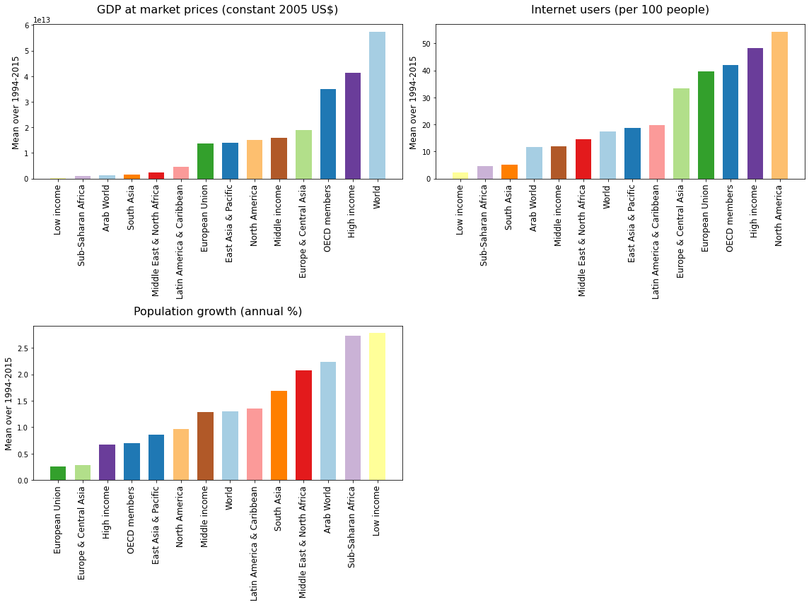
&nbsp;

* The best performing regions accross years on the selected indicators are: 
    * Europe
    * North America
    * East Asia & Pacific

* We will focus on comparing countries within these regions
&nbsp;

### Missing value analysis : countries to delete

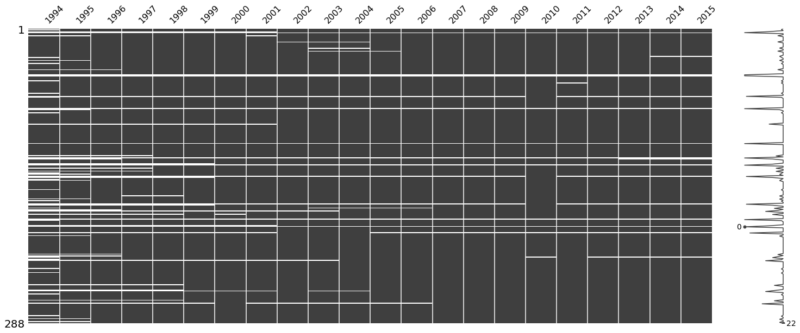
&nbsp;

* Some countries have lots of missing values accross years
* We should delete them so we can compare the countries accross all indicators
&nbsp;

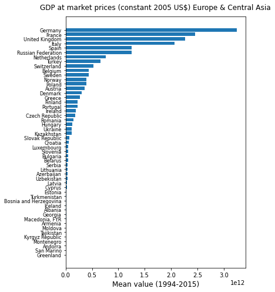
&nbsp;

Without surprises, Germany, France & UK lead the European ranking on GDP indicator accross the last 2 decades.

### Defining a score accross indicators

## Defining a score

In order to compare countries on a common basis, we will assign a score to each country in each region based on its performance on each of the indicators.

* We set the following weighting: 

    * 4 for GDP: we believe that GDP is the overriding criterion: the more a country generates revenues, the more wealth it distributes to its inhabitants and the potential customers for a business company increases. 
    
    * 2 for Internet access rate : But sometimes GDP is explained by a 'population' effect, and the wealth per capita remains modest. However, we have seen that the Internet access rate was positively correlated to the GDP per capita, so we attribute a coefficient of 2 to it.
    
    * 1 for population growth : Finally, a positive population growth rate will mean, all other things being equal, that the number of potential customers for an investing company will remain at least stable.
&nbsp;
 

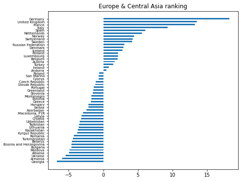
&nbsp;

* The graph above shows the ranking of the countries selected on the basis of this score. 
The values have been normalized so that they can be added together.
&nbsp;

### Best countries accross regions

The countries with the highest scores in each of the three major regions are : 
* in Europe: 
    * Germany, the United Kingdom, Switzerland, Norway, the Netherlands, Italy and Spain
* in Asia & Pacific: 
    * Japan, China, South Korea, Singapore, Australia and New Zealand
* in North America: 
    * the United States, Canada and the United States of America.

We will now assess the trend of each of these countries on the three indicators in order to make a final selection
&nbsp;

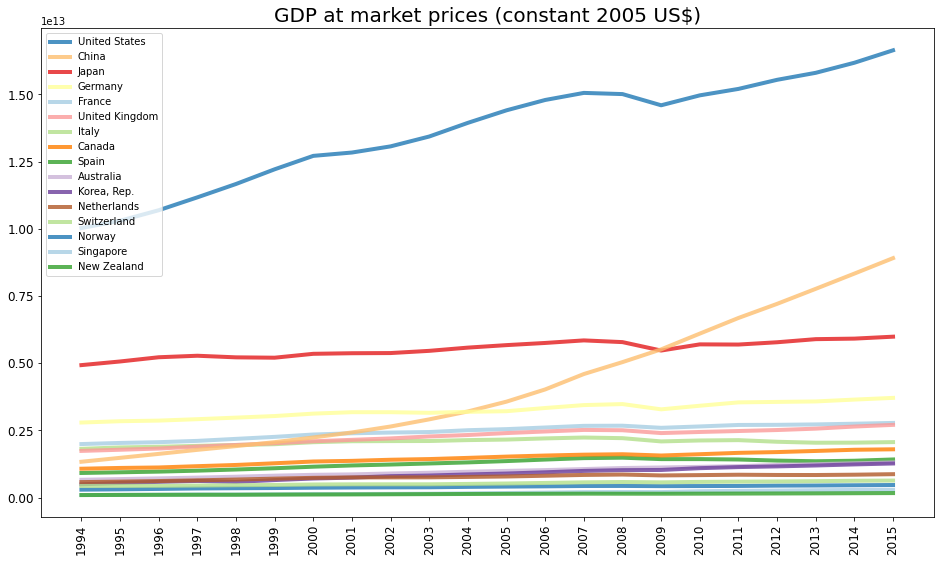
&nbsp;

## Final ranking on defined score

In the same way as above, we will establish a score that takes into account the performance of countries on each of the indicators during the period 1994-2015. Then we will visualize the final ranking.

* The weighting remains the same as above:
  * 4 points for GDP
  * 2 points for the Internet access rate 
  * 1 point for population growth
&nbsp;

&nbsp;

# Conclusion

* The final ranking recognizes the United States, Japan, Canada and Norway as the most performing on our three indicators in the last two decades

* An area of improvement could be to give a higher weight to most recent indicator values 

* The main goal of this project was to compare countries by producing the best visualizations possible to find insights and make relevant business decisions

* The analytical workflow displayed in the project may serve as a method and be reproduced to address other particular BI problems
&nbsp;

## The notebook is accessible [here](Notebook.ipynb)

                            

          
 
           

                         

